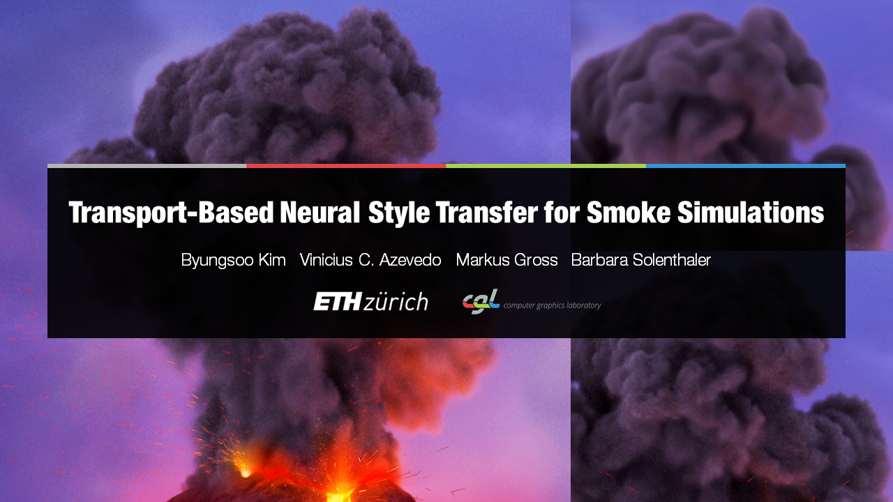
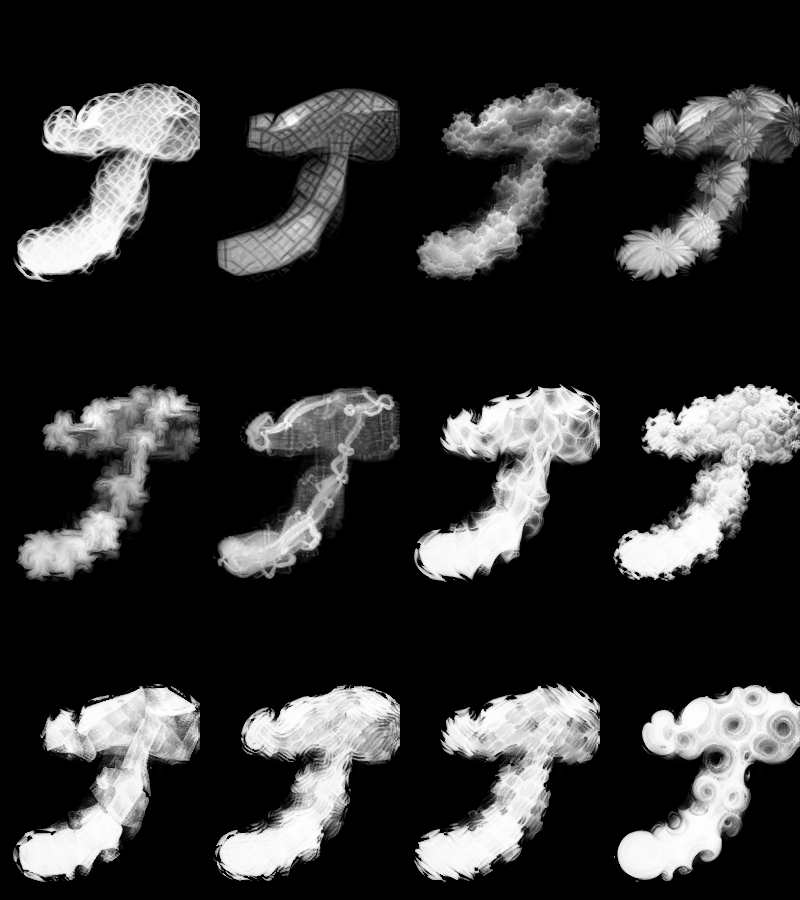
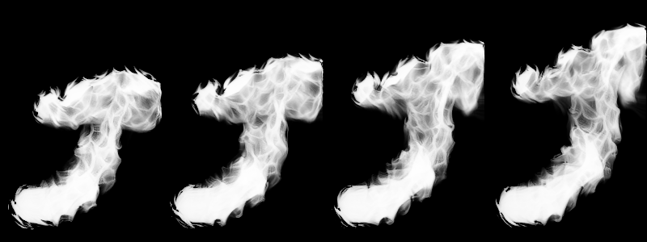

# Transport-Based Neural Style Transfer for Smoke Simulations

Tensorflow implementation of [Transport-Based Neural Style Transfer for Smoke Simulations](http://www.byungsoo.me/project/neural-flow-style).

[Byungsoo Kim](http://www.byungsoo.me), [Vinicius C. Azevedo](http://graphics.ethz.ch/~vviniciu/), [Markus Gross](https://graphics.ethz.ch/people/grossm), [Barbara Solenthaler](https://graphics.ethz.ch/~sobarbar/)

[Computer Graphics Laboratory](https://cgl.ethz.ch/), ETH Zurich

## Requirements

This code is tested on Windows 10 and Ubuntu 16.04 with GTX 1080 (8GB) and the following requirements:

- [Python 3](https://www.python.org/)
- [TensorFlow 1.12](https://www.tensorflow.org/install/)
- [mantaflow](http://mantaflow.com)

Firstly, clone our code including mantaflow:

    $ git clone --recurse-submodules https://gitlab.com/kimby/neural-flow-style.git

Then run `setup.bat` or `setup.sh` for setup. (might need to change)

Lastly, download the pre-trained [inception](https://storage.googleapis.com/download.tensorflow.org/models/inception5h.zip) network, and unzip it in `data/model`.

## Usage

Run a script for the dataset generation using mantaflow. For instance,

    $ .\manta\build\Release\manta.exe ./scene/smoke_gun.py

This script will simulate a `smoke gun` scene described in our paper and store density and velocity fields in `data/smoke_gun/d` and `data/smoke_gun/v`, respectively.

Note that the current version only supports `npz` numpy array format. 

To stylize a single frame with a net structure:
    
    $ python styler.py --tag net --content_layer mixed3b_3x3_bottleneck_pre_relu --content_channel 44

For further details about parameters and examples, please take a closer look at `run.bat` or `run.sh`, and for semantic transfer, see [this page](http://storage.googleapis.com/deepdream/visualz/tensorflow_inception/index.html) for pattern selection.

## Houdini Plugin

We also provide a Houdini plugin, a user-friendly and an artist-centered tool for Smoke Stylization.

This tool lets you take smoke simulations you've created in Houdini and stylize them. This gives them the aesthetic and apperance of your choice, whilst remaining governed by the physical accuracy of the simulation.

### Usage
0. Ensure you have Houdini installed. If not, [download it](https://www.sidefx.com/download/).
    
    * You do not need the commercial version.

1. Open a Houdini smoke simulation or [create one from scratch](https://www.youtube.com/watch?v=aMSJ1v6xCag). Regardless, you should have a "pyro_import" geometry node.
2. File > Import > Houdini Digital Asset..., navigate to the this repository and select a [smoke_stylizer.hdanc](./houdini/smoke_stylizer.hdanc) file. Click Install.
3. Enter the "pyro_import" geometry node. In the /obj/pyro_import Network view, Add > Node > Digital Assets > Smoke stylizer.
4. Connect the "import pyrofields" node's output to the input of our "Smoke_Stylizer_Oz" node.

5. Click on the Smoke Stylizer digital asset. Set the "Python version" and "Python Path" to that of the Houdini-independent python you have installed (e.g., `C:\Users\user_name\AppData\Local\Programs\Python\Python36`). Set the "Stylizer Path" to this repository (e.g., `C:\Users\user_name\dev\neural-flow-style`).

6. Tweak other details as you wish. Otherwise, click "New Stylization". Stylization will begin on the next frame after.

* If confused, you may refer to our example scene, [demo.hipnc](./houdini/demo.hipnc)

## Results (single frame)

## Results (sequence)

## Author

[Byungsoo Kim](http://www.byungsoo.me) / [@byungsook](https://github.com/byungsook)

Penelope Tay / [@ozeuth](https://gitlab.com/ozeuth) for Houdini Plugin