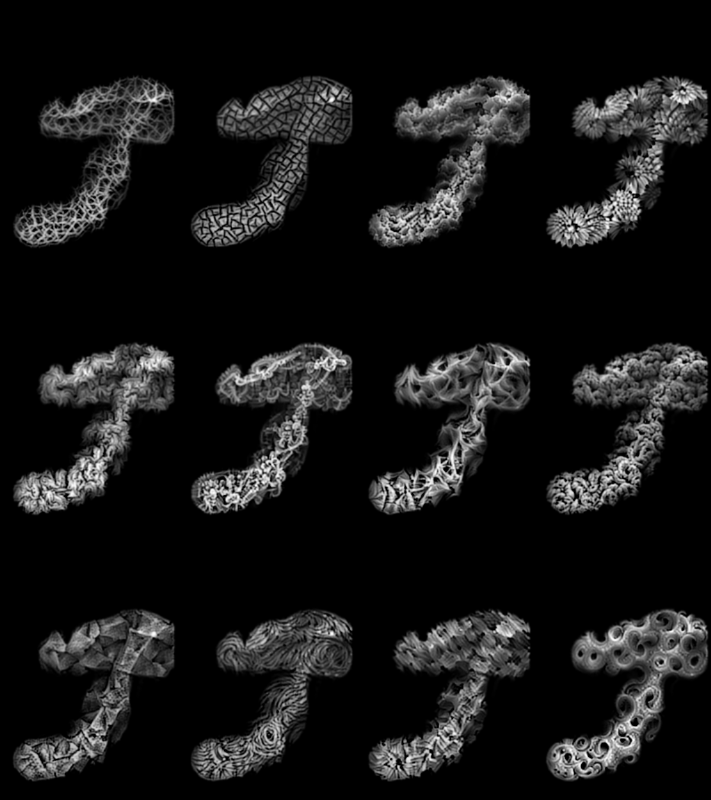
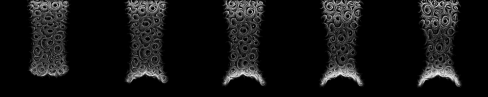

# Lagrangian Neural Style Transfer for Fluids

Tensorflow implementation of [Lagrangian Neural Style Transfer for Fluids](http://www.byungsoo.me/project/lnst).

[Byungsoo Kim](http://www.byungsoo.me), [Vinicius C. Azevedo](http://graphics.ethz.ch/~vviniciu/), [Markus Gross](https://graphics.ethz.ch/people/grossm), [Barbara Solenthaler](https://graphics.ethz.ch/~sobarbar/)

[Computer Graphics Laboratory](https://cgl.ethz.ch/), ETH Zurich

(Note that [Transport-Based Neural Style Transfer for Smoke Simulations (TNST)](http://www.byungsoo.me/project/neural-flow-style) implementation is moved to `tnst` branch.)

## Requirements

This code is tested on Windows 10 with GTX 1080 (8GB) and the following requirements:

- [Python 3](https://www.python.org/)
- [TensorFlow 1.15](https://www.tensorflow.org/install/)
- [mantaflow](http://mantaflow.com)
- [SPlisHSPlash](https://github.com/InteractiveComputerGraphics/SPlisHSPlasH)
- [Partio](https://github.com/wdas/partio)

Run `setup.bat` for setup. (3rd parties must be installed manually).

Also download the pre-trained [inception](https://storage.googleapis.com/download.tensorflow.org/models/inception5h.zip) and [vgg19](http://download.tensorflow.org/models/vgg_19_2016_08_28.tar.gz) networks, and unzip it in `data/model`.

## Usage

For details about parameters and examples, please take a closer look at `run.bat` and corresponding demo code, and for semantic transfer, see [this page](http://storage.googleapis.com/deepdream/visualz/tensorflow_inception/index.html) for pattern selection.

## Results (smokegun, single frame)

## Results (chocolate, sequence)

## Results (dambreak2d, sequence)

## Author

[Byungsoo Kim](http://www.byungsoo.me) / [byungsook@github](https://github.com/byungsook)